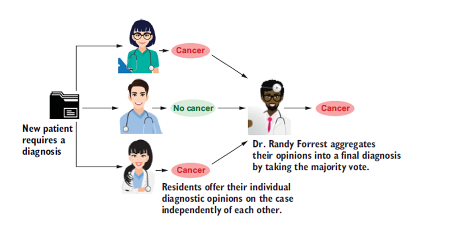

## Introduction:  
Ensemble methods represents a cornerstone in the realm of machine learning, embodying a powerful strategy that capitalizes on the collective intelligence of diverse learning algorithms to yield superior predictive performance. As the landscape of data-driven technologies evolves, the significance of ensemble methods continues to surge, reshaping the paradigms of model development and refining the art of predictive analytics.

The genesis of ensemble methods traces back to seminal challenges such as the Netflix Prize in October 2006, a groundbreaking competition that captivated the data science community. The Netflix Grand Prize offered $1 million to improve movie recommendation system by 10%. Initially, 40 teams surpassed Netflix’s recommendation system within three weeks, and over 40,000 teams entered the competition by 2007. Competitors collaborated, sharing strategies, and eventually combined various models into powerful ensembles that proved more effective. In 2009, BellKor’s Pragmatic Chaos(https://bit.ly/3Tw7SeY), a merger of three teams, won the prize with a 10.06% improvement, narrowly beating the ensemble. This competition highlighted ensemble methods’ significance, with Andreas Törscher and Michael Jahrer emphasizing its role in improving accuracy. The eventual triumph of ensemble methods in this competition not only revolutionized recommendation systems but also solidified the prominence of ensembles as a transformative force in machine learning.

Ensemble methods come in diverse forms, including but not limited to bagging, boosting, stacking, and hybrid approaches. These techniques integrate an array of algorithms, each contributing a unique perspective, thereby enriching the collective learning process and culminating in models that outperform their individual constituents.

Throughout this article, we talk on a journey to unravel the nuances of ensemble methods. We explore the fundamental principles underlying their efficacy, dissect the mechanics of their synergy, and delve into real-world applications across domains. 

# I.	Ensemble methods: Collective Intelligence  
To comprehend the essence of ensemble methods, let’s embark on an allegorical journey (illustrated by Gautam Kunapuli in his book Ensemble Methods for Machine Learning) with Dr. Randy Forrest, an esteemed diagnostician reminiscent of the famed Dr. Gregory House of TV fame. Dr. Forrest’s exceptional diagnostic prowess doesn’t solely stem from his politeness, a stark contrast to his idol; it’s his unorthodox approach to diagnosis that sets him apart.

Operating within a teaching hospital, Dr. Forrest has assembled a diverse team of residents, each wielding expertise in various medical specializations. Their collective knowledge is diverse and robust – cardiology, pulmonology, neurology, and so on –each resident contributing their unique strengths to the group.

Figure 1 

When a new case surfaces, Dr. Forrest consults his residents, gathering an array of possible diagnoses from each. Employing a democratic approach, he selects the most common diagnosis proposed by the team –a diagnostic ensemble in action. Dr. Forrest merges these varied diagnoses into a unified conclusion, a representation of his team’s collective wisdom. 
Why does this method prove more accurate than relying on individual residents? 
Dr. Forrest understands that a multitude of smart residents is unlikely to unanimously err. It’s the power of aggregation – he embraces the idea that the average answer often proves to be the right one.

Yet, he safeguards against unanimity in errors by leveraging the diversity within his team. The electric mix of specialized expertise ensures the unlikelihood of collective misjudgment –an illustration of ensemble diversity at work.

In the realm of machine learning, Dr. Randy Forrest symbolizes an ensemble method, his residents embodying the machine learning algorithms forming the ensemble. The secrets to their success – shared by ensemble methods – lay in ensemble diversity and model aggregation. The fusion of diverse opinions enables the ensemble to make more accurate predictions.

— Page 5 , Ensemble Method for Machine Learnings, Gautam Kunapuli

II.	Fit vs. complexity in individual models:

This section introduces two prominent machine-learning methods: decision trees and support vector machines (SVMs). It delves into their evolving behavior as they learn increasingly intricate models, also serving as a review of the standard training and evaluation practices in modeling.

Machine learning tasks are broadly divided into supervised learning, where data includes labeled examples (e.g., cancer diagnoses), and unsupervised learning, where data lacks annotations (e.g., clustering or anomaly detection).

To exemplify the challenges in training machine learning models, a straightforward, synthetically generated supervised regression dataset is utilized. The aim is to illustrate the necessary for ensemble for ensemble methods by showcasing how machine learning models can fit and eventually overfit the data during training. It emphasizes that overfitting during training doesn’t necessarily result in models that generalize better.

1.	Regression with decision trees: 

•	Overview:
	Functionality: Decision trees serve in both classification and regression tasks.
	Composition: Comprised of decision nodes and leaf nodes.
	Node function: Decision nodes test specific conditions within an example.
•	Example illustration:
o	A decision-tree classifier for a binary classification task over a data set with two features, x1 and x2. 
o	The first node tests each input example to see if the second feature x2 is greater than 5 and then funnels the example to the right or left branch decision tree depending on the result.
o	This continues until the input example reaches a leaf node, then the prediction corresponding to the leaf node is returned. 
 

