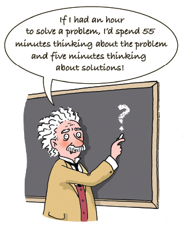
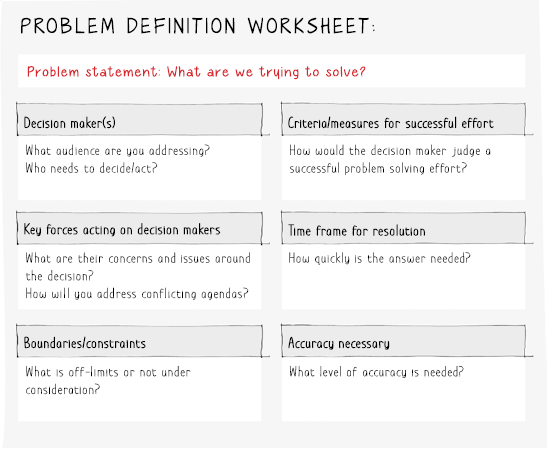

             

<!--   
    Introduction 
 -->

Problem-solving is a skill essential in both personal and professional realms. Whether addressing issues in our daily lives or tackling complex challenges in various fields, the ability to effectively solve problems is invaluable. However, often overlooked is the pivotal role that **problem definition** plays in this process. A problem poorly defined is a problem half-solved, highlighting the significance of crafting a clear and precise problem statement as the cornerstone of successful resolution.

  
    Understanding the Significance of Problem Definition

 
Before delving into solutions, it's crucial to grasp the nature and scope of the problem at hand. Problem definition involves identifying, analyzing, and articulating the issue in a concise manner. Without a well-defined problem statement, the solutions devised may miss the mark or address symptoms rather than root causes.

Clarity in problem definition serves as a roadmap, guiding problem solvers toward effective strategies. It helps in setting boundaries, narrowing down focus areas, and determining the criteria for a successful resolution. Essentially, it sets the stage for the entire problem-solving process.

Good problem statements have a number of characteristics.
They are: 
<ul>
    <li>Outcomes focused: A clear statement of the problem to be solved, expressed in outcomes, not activities or intermediate outputs.</li>
    <li>Specific and measurable wherever possible.</li>
    <li>Clearly time-bound.</li>
    <li>Designed to explicitly address decision-maker values and boundaries, including the accuracy needed and the scale of aspirations.</li>
    <li>Structured to allow sufficient scope for creativity and unexpected results—too narrowly scoped problems can artificially constrain solutions.</li>
    <li>Solved at the highest level possible, meaning for the organization as a whole, not just optimized for a part or a partial solution.</li>
</ul>

Figure 2: Problem definition worksheet from the Bulletproof problem solving

  
    Challenges in Problem Definition

Despite its importance, defining a problem accurately can be challenging. Some common hurdles include:

**Ambiguity**: Problems are often complex and multifaceted, leading to ambiguity in understanding the underlying issues.

**Assumptions and Biases:** Preconceived notions and biases might influence how a problem is defined, potentially leading to overlooking critical aspects.

**Scope Creep:** A lack of boundaries or continuously evolving parameters can blur the problem's scope, making it challenging to pinpoint and address.

**Strategies for Effective Problem Definition:**
To overcome these challenges and articulate a clear problem statement, several strategies can be employed:

**Root Cause Analysis:** 
Digging deep to identify the underlying causes rather than focusing solely on surface-level symptoms.
Stakeholder Involvement: Gathering perspectives from various stakeholders to ensure a comprehensive understanding of the problem.

**Define Boundaries:** Setting clear boundaries helps in narrowing down the scope and focusing efforts on specific aspects.
Use of Problem-Solving Tools: Utilizing frameworks like the 5 Whys, mind mapping, or fishbone diagrams can aid in structuring the problem analysis process.
Benefits of Precise Problem Definition:
A well-defined problem statement offers several advantages:

**Efficient Resource Allocation:**  
Clear problem definition prevents wasted efforts by directing resources toward targeted solutions.
Enhanced Creativity: A precise problem statement encourages innovative thinking by providing a focused challenge.
Improved Decision Making: It facilitates better decision-making as it allows for a thorough understanding of the problem's nuances.

  
    Conclusion

In conclusion, the significance of problem definition cannot be overstated in the realm of problem-solving. It serves as the guiding light that steers the course of finding viable solutions. By investing time and effort in articulating a clear problem statement, individuals and organizations pave the way for effective problem-solving processes, leading to more sustainable and impactful resolutions. Mastering the art of problem definition is, therefore, fundamental in navigating the complex landscape of problem-solving endeavors.

Content from [wikipedia](https://en.wikipedia.org/wiki/Machining)
