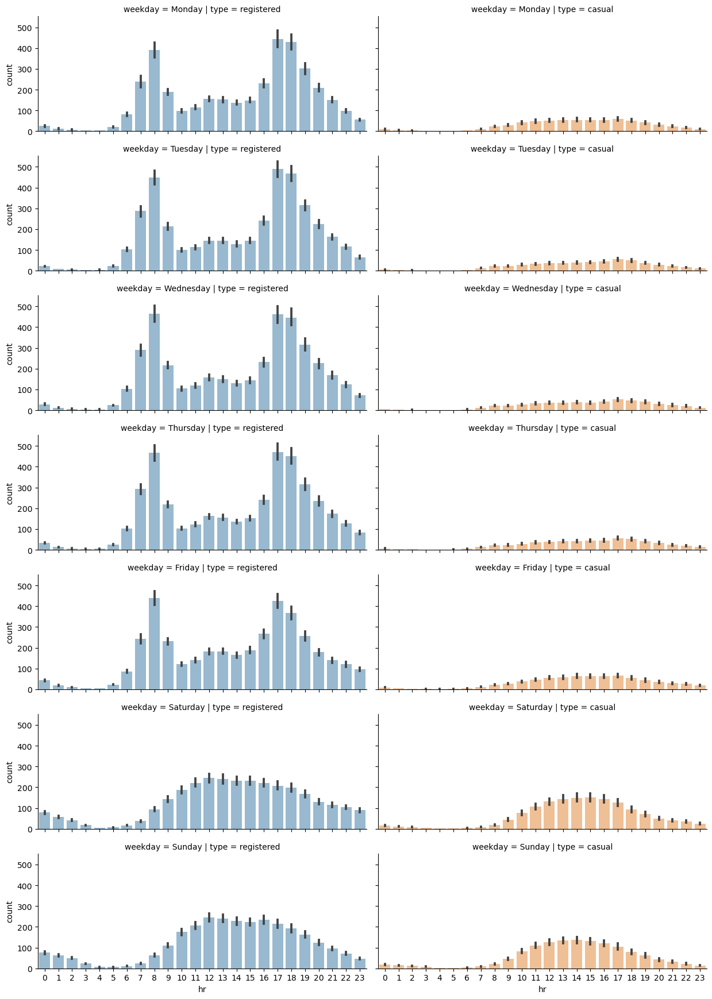

# Bike share Analysis

In this project, we will analyze the data from a bike sharing service and identify the usage patterns depending on time features and weather conditions. 

The goal is to reduce the gap between theoritical knoweledge and pratical experience by applying concepts such as data understanding, data cleaning, visual analysis,hypothesis testing and time series to the available dataset.

The dataset used can be found here: https://bit.ly/47ttIDJ


### Contents:

* [Introduction](#0)
* [1. Inderstanding the Data](#1)
* [2. Data Preprocessing](#2)
* [3. Exploratory data analysis](#3)
    * [Univariate analysis](#4)
    * [Registered versus Casual Users Analysis](#5)
    * [Distributions of requests over separate hours and days of the week](#6)
    * [Seasonal Impact on Rides](#7)
    * [Hypothesis Testing on Registered Rides](#8)
    * [Hypothesis Testing on Casual Rides](#9)
    * [Analysis of Weather-Related Features](#10)
    * [Time series analysis](#11)

<a id='0'></a>
## Introduction:

Bike sharing stands as a foundational service within the urban mobility landscape. Its accessibility without the need for a driving license, cost-effectiveness compared to traditional car-sharing services due to lower maintenance and insurance expenses, and the swiftness it offers for city commuting make it highly attractive. Consequently, comprehending the pivotal factors that drive bike sharing requests holds significant importance for both companies providing these services and the users who rely on them.


<a id='1'></a>
## 1. Understanding the Data:


<div>
<style scoped>
    .dataframe tbody tr th:only-of-type {
        vertical-align: middle;
    }

    .dataframe tbody tr th {
        vertical-align: top;
    }

    .dataframe thead th {
        text-align: right;
    }
</style>
<table border="1" class="dataframe">
  <thead>
    <tr style="text-align: right;">
      <th></th>
      <th>instant</th>
      <th>dteday</th>
      <th>season</th>
      <th>yr</th>
      <th>mnth</th>
      <th>hr</th>
      <th>holiday</th>
      <th>weekday</th>
      <th>workingday</th>
      <th>weathersit</th>
      <th>temp</th>
      <th>atemp</th>
      <th>hum</th>
      <th>windspeed</th>
      <th>casual</th>
      <th>registered</th>
      <th>cnt</th>
    </tr>
  </thead>
  <tbody>
    <tr>
      <th>0</th>
      <td>1</td>
      <td>2011-01-01</td>
      <td>1</td>
      <td>0</td>
      <td>1</td>
      <td>0</td>
      <td>0</td>
      <td>6</td>
      <td>0</td>
      <td>1</td>
      <td>0.24</td>
      <td>0.2879</td>
      <td>0.81</td>
      <td>0.0</td>
      <td>3</td>
      <td>13</td>
      <td>16</td>
    </tr>
    <tr>
      <th>1</th>
      <td>2</td>
      <td>2011-01-01</td>
      <td>1</td>
      <td>0</td>
      <td>1</td>
      <td>1</td>
      <td>0</td>
      <td>6</td>
      <td>0</td>
      <td>1</td>
      <td>0.22</td>
      <td>0.2727</td>
      <td>0.80</td>
      <td>0.0</td>
      <td>8</td>
      <td>32</td>
      <td>40</td>
    </tr>
    <tr>
      <th>2</th>
      <td>3</td>
      <td>2011-01-01</td>
      <td>1</td>
      <td>0</td>
      <td>1</td>
      <td>2</td>
      <td>0</td>
      <td>6</td>
      <td>0</td>
      <td>1</td>
      <td>0.22</td>
      <td>0.2727</td>
      <td>0.80</td>
      <td>0.0</td>
      <td>5</td>
      <td>27</td>
      <td>32</td>
    </tr>
    <tr>
      <th>3</th>
      <td>4</td>
      <td>2011-01-01</td>
      <td>1</td>
      <td>0</td>
      <td>1</td>
      <td>3</td>
      <td>0</td>
      <td>6</td>
      <td>0</td>
      <td>1</td>
      <td>0.24</td>
      <td>0.2879</td>
      <td>0.75</td>
      <td>0.0</td>
      <td>3</td>
      <td>10</td>
      <td>13</td>
    </tr>
    <tr>
      <th>4</th>
      <td>5</td>
      <td>2011-01-01</td>
      <td>1</td>
      <td>0</td>
      <td>1</td>
      <td>4</td>
      <td>0</td>
      <td>6</td>
      <td>0</td>
      <td>1</td>
      <td>0.24</td>
      <td>0.2879</td>
      <td>0.75</td>
      <td>0.0</td>
      <td>0</td>
      <td>1</td>
      <td>1</td>
    </tr>
  </tbody>
</table>
</div>


According to the description of the original data, provided in the **Readme.txt** file (data folder), we can split the columns into three main groups:

• **Temporal features:** This contains information about the time at which the record was registered. This group contains the dteday, season, yr, mnth, hr, holiday, weekday, and workingday columns.

• **Weather related features:** This contains information about the weather conditions. The weathersit, temp, atemp, hum, and windspeed columns are included in this group.

• **Record related features:** This contains information about the number of records for the specific hour and date. This group includes the casual, registered, and cnt columns.


    <class 'pandas.core.frame.DataFrame'>
    RangeIndex: 17379 entries, 0 to 17378
    Data columns (total 17 columns):
     #   Column      Non-Null Count  Dtype  
    ---  ------      --------------  -----  
     0   instant     17379 non-null  int64  
     1   dteday      17379 non-null  object 
     2   season      17379 non-null  int64  
     3   yr          17379 non-null  int64  
     4   mnth        17379 non-null  int64  
     5   hr          17379 non-null  int64  
     6   holiday     17379 non-null  int64  
     7   weekday     17379 non-null  int64  
     8   workingday  17379 non-null  int64  
     9   weathersit  17379 non-null  int64  
     10  temp        17379 non-null  float64
     11  atemp       17379 non-null  float64
     12  hum         17379 non-null  float64
     13  windspeed   17379 non-null  float64
     14  casual      17379 non-null  int64  
     15  registered  17379 non-null  int64  
     16  cnt         17379 non-null  int64  
    dtypes: float64(4), int64(12), object(1)
    memory usage: 2.3+ MB
    

We can observe that the dataset has 17379 records and 17 columns. There are no missing values.  We can also see that the dteday column is an object data type, we will need to change it to datetime so that we can for with time series.


<div>
<style scoped>
    .dataframe tbody tr th:only-of-type {
        vertical-align: middle;
    }

    .dataframe tbody tr th {
        vertical-align: top;
    }

    .dataframe thead th {
        text-align: right;
    }
</style>
<table border="1" class="dataframe">
  <thead>
    <tr style="text-align: right;">
      <th></th>
      <th>instant</th>
      <th>season</th>
      <th>yr</th>
      <th>mnth</th>
      <th>hr</th>
      <th>holiday</th>
      <th>weekday</th>
      <th>workingday</th>
      <th>weathersit</th>
      <th>temp</th>
      <th>atemp</th>
      <th>hum</th>
      <th>windspeed</th>
      <th>casual</th>
      <th>registered</th>
      <th>cnt</th>
    </tr>
  </thead>
  <tbody>
    <tr>
      <th>count</th>
      <td>17379.0000</td>
      <td>17379.000000</td>
      <td>17379.000000</td>
      <td>17379.000000</td>
      <td>17379.000000</td>
      <td>17379.000000</td>
      <td>17379.000000</td>
      <td>17379.000000</td>
      <td>17379.000000</td>
      <td>17379.000000</td>
      <td>17379.000000</td>
      <td>17379.000000</td>
      <td>17379.000000</td>
      <td>17379.000000</td>
      <td>17379.000000</td>
      <td>17379.000000</td>
    </tr>
    <tr>
      <th>mean</th>
      <td>8690.0000</td>
      <td>2.501640</td>
      <td>0.502561</td>
      <td>6.537775</td>
      <td>11.546752</td>
      <td>0.028770</td>
      <td>3.003683</td>
      <td>0.682721</td>
      <td>1.425283</td>
      <td>0.496987</td>
      <td>0.475775</td>
      <td>0.627229</td>
      <td>0.190098</td>
      <td>35.676218</td>
      <td>153.786869</td>
      <td>189.463088</td>
    </tr>
    <tr>
      <th>std</th>
      <td>5017.0295</td>
      <td>1.106918</td>
      <td>0.500008</td>
      <td>3.438776</td>
      <td>6.914405</td>
      <td>0.167165</td>
      <td>2.005771</td>
      <td>0.465431</td>
      <td>0.639357</td>
      <td>0.192556</td>
      <td>0.171850</td>
      <td>0.192930</td>
      <td>0.122340</td>
      <td>49.305030</td>
      <td>151.357286</td>
      <td>181.387599</td>
    </tr>
    <tr>
      <th>min</th>
      <td>1.0000</td>
      <td>1.000000</td>
      <td>0.000000</td>
      <td>1.000000</td>
      <td>0.000000</td>
      <td>0.000000</td>
      <td>0.000000</td>
      <td>0.000000</td>
      <td>1.000000</td>
      <td>0.020000</td>
      <td>0.000000</td>
      <td>0.000000</td>
      <td>0.000000</td>
      <td>0.000000</td>
      <td>0.000000</td>
      <td>1.000000</td>
    </tr>
    <tr>
      <th>25%</th>
      <td>4345.5000</td>
      <td>2.000000</td>
      <td>0.000000</td>
      <td>4.000000</td>
      <td>6.000000</td>
      <td>0.000000</td>
      <td>1.000000</td>
      <td>0.000000</td>
      <td>1.000000</td>
      <td>0.340000</td>
      <td>0.333300</td>
      <td>0.480000</td>
      <td>0.104500</td>
      <td>4.000000</td>
      <td>34.000000</td>
      <td>40.000000</td>
    </tr>
    <tr>
      <th>50%</th>
      <td>8690.0000</td>
      <td>3.000000</td>
      <td>1.000000</td>
      <td>7.000000</td>
      <td>12.000000</td>
      <td>0.000000</td>
      <td>3.000000</td>
      <td>1.000000</td>
      <td>1.000000</td>
      <td>0.500000</td>
      <td>0.484800</td>
      <td>0.630000</td>
      <td>0.194000</td>
      <td>17.000000</td>
      <td>115.000000</td>
      <td>142.000000</td>
    </tr>
    <tr>
      <th>75%</th>
      <td>13034.5000</td>
      <td>3.000000</td>
      <td>1.000000</td>
      <td>10.000000</td>
      <td>18.000000</td>
      <td>0.000000</td>
      <td>5.000000</td>
      <td>1.000000</td>
      <td>2.000000</td>
      <td>0.660000</td>
      <td>0.621200</td>
      <td>0.780000</td>
      <td>0.253700</td>
      <td>48.000000</td>
      <td>220.000000</td>
      <td>281.000000</td>
    </tr>
    <tr>
      <th>max</th>
      <td>17379.0000</td>
      <td>4.000000</td>
      <td>1.000000</td>
      <td>12.000000</td>
      <td>23.000000</td>
      <td>1.000000</td>
      <td>6.000000</td>
      <td>1.000000</td>
      <td>4.000000</td>
      <td>1.000000</td>
      <td>1.000000</td>
      <td>1.000000</td>
      <td>0.850700</td>
      <td>367.000000</td>
      <td>886.000000</td>
      <td>977.000000</td>
    </tr>
  </tbody>
</table>
</div>


We can say that the maximum casual hourly ride is 367 while it is 887 for the registered rides. 

<a id='2'></a>
### 2. Data Preprocessing

In this section, we perform data cleaning, transformation and scaling.

**Transform seasons**


```python
# create a season dictionary
seasons_mapping = {1:'winter', 2:'spring', 3:'summer', 4:'fall'}

# mapping the season dictionary to the season column
df['season'] = df['season'].map(seasons_mapping)
```

**Transform yr**


```python
# create a yr dictionary
yr_mapping = {0:2011, 1:2012}

# mapping the yr dictionary to the yr column
df['yr'] = df['yr'].map(yr_mapping)
```

**Transform weekday**


```python
# create a weekday dictionary
weekday_mapping = {0:'Sunday', 1:'Monday', 2:'Tuesday', 3:'Wednesday',
                   4:'Thursday', 5:'Friday', 6:'Saturday'}

# mapping the weekday dictionary to the weekday column
df['weekday'] = df['weekday'].map(weekday_mapping)
```

**Transform weathersit**


```python
# create a weathersit dictionary
weather_mapping = {1: 'clear', 
                   2: 'cloudy', 
                   3: 'light_rain_snow', 
                   4: 'heavy_rain_snow'}

# mapping the weather dictionary
df['weathersit'] = df['weathersit'].map(weather_mapping)
```

**Transform humidity (hum) and wind speed**


```python
# transform hum and windspeed

df['hum'] = df['hum'] * 100

df['windspeed'] = df['windspeed'] * 67
```


```python
# visualize the result the transformations

df[['season', 'yr', 'weekday', 'weathersit', 'hum', 'windspeed']].head()
```


<div>
<style scoped>
    .dataframe tbody tr th:only-of-type {
        vertical-align: middle;
    }

    .dataframe tbody tr th {
        vertical-align: top;
    }

    .dataframe thead th {
        text-align: right;
    }
</style>
<table border="1" class="dataframe">
  <thead>
    <tr style="text-align: right;">
      <th></th>
      <th>season</th>
      <th>yr</th>
      <th>weekday</th>
      <th>weathersit</th>
      <th>hum</th>
      <th>windspeed</th>
    </tr>
  </thead>
  <tbody>
    <tr>
      <th>0</th>
      <td>winter</td>
      <td>2011</td>
      <td>Saturday</td>
      <td>clear</td>
      <td>81.0</td>
      <td>0.0</td>
    </tr>
    <tr>
      <th>1</th>
      <td>winter</td>
      <td>2011</td>
      <td>Saturday</td>
      <td>clear</td>
      <td>80.0</td>
      <td>0.0</td>
    </tr>
    <tr>
      <th>2</th>
      <td>winter</td>
      <td>2011</td>
      <td>Saturday</td>
      <td>clear</td>
      <td>80.0</td>
      <td>0.0</td>
    </tr>
    <tr>
      <th>3</th>
      <td>winter</td>
      <td>2011</td>
      <td>Saturday</td>
      <td>clear</td>
      <td>75.0</td>
      <td>0.0</td>
    </tr>
    <tr>
      <th>4</th>
      <td>winter</td>
      <td>2011</td>
      <td>Saturday</td>
      <td>clear</td>
      <td>75.0</td>
      <td>0.0</td>
    </tr>
  </tbody>
</table>
</div>


<a id='3'></a>
### 3. Exploratory Data Analysis

<a id='4'></a>
#### Univariate analysis

We begin our analysis of the single features by focusing on the two main ones: 
 
- **registered:** The number of rides performed by registered users
- **casual:** The number of rides performed by non-registered ones.


    

    


We can say from the charts, both distributions are right-skewed.

<a id='5'></a>
#### Registered versus Casual Use Analysis


    

    


We can see from the above figure that the number of registered rides is always above and significantly higher than the number of casual rides per day. Furthermore, we can observe that during winter, the overall number of rides decreases (which is totally in line with our expectations, as bad weather and low temperatures have a negative impact on ride sharing services).

We can notice that there is quite a lot of variance in the time series of the rides in the above figure. One way to smooth out the curves is to take the rolling mean and standard deviation of the two time series and plot those instead. In this way, we can visualize not only the average number of rides for a specific time period (also known as a window) but also the expected deviation from the mean


    

    


<a id='6'></a>
### Distributions of requests over separate hours and days of the week


    


    

    


We can immediately note that on working days, the highest number of rides for registered users takes place around 8 AM and at 6 PM, with more rides for registered users. The distribution for registered users is nearly bimodal with the modes being 8 AM and 5 PM. 

During the weekend, we can see that ride distributions change for both casual and registered users. Still registered rides are more frequendt than casual ones, but both distributions have the same shape, almost uniformily distributed between the time interval of 11 AM to 6 PM.

<a id='7'></a>
### Seasonal Impact on Rides

We will investigate the impact of the different seasons on the number of rides per hour.
    

    


As can be seen in the plot, while each season has a similar graph shape, the count is lower for the winter graph as we can see in the following chart. So there are fewer rides (registered and casual) during winter.


    

    


```python
# select the subset of data
plot_data = plot_data = df[['weekday', 'season', 'registered', 'casual']]

#
plot_data = plot_data.melt(id_vars=['weekday', 'season'],  var_name='type', value_name='count')

#
grid = sns.FacetGrid(plot_data, row= 'season', col='type',hue = 'type', height=2.5, aspect=2.5)

#
grid.map(sns.barplot, 'weekday', 'count', alpha=0.5, 
         order=['Monday', 'Tuesday', 'Wednesday', 'Thursday','Friday', 'Saturday', 'Sunday'])
```

    C:\Users\Glenn Pascal M\anaconda3\Lib\site-packages\seaborn\axisgrid.py:118: UserWarning: The figure layout has changed to tight
      self._figure.tight_layout(*args, **kwargs)
    


    <seaborn.axisgrid.FacetGrid at 0x20523f0f010>


    

    


The shape of rides for registered users is nearly uniformilly distributed with a decreasing number of rides over the weekend, while the number of casual rides increases on the weekend.

This could enforce our initial hypothesis, that is, that registered customers mostly use the bike sharing service for commuting (which could be the reason for the decreasing number of registered rides over the weekend), while casual customers use the service occasionally over the weekend.

Of course, such a conclusion cannot be based solely on plot observations but has to be backed by statistical tests, which is the topic of our next section.

<a id='8'></a>
### Hypothesis Testing on Registered Rides

In the previous section, we observed, graphically, that registered users tend to perform more rides during working days 
than the weekend. 
In order to assess this statement, we will perform a hypothesis test in which we will test whether the mean of registered
rides during working days is the same as during the weekend.

Let's check whether there is a significant difference between registered rides during working days and the weekend.

**$H_0$:** average registered rides over weekdays - average registered rides over weekend = 0

and

**$H_1$:** average registered rides over weekdays - average registered rides over weekend $\neq$0


    Statistic value:12.522920542969024, p-value:0.000


The resulting p-value from this test is far below the standard critical 0.05 value. As a conclusion, we can reject the null hypothesis and confirm that our initial observation is correct: that is, there is a statistically significant difference between the number of rides performed during working days and the weekend.


    

    


<a id='9'></a>
### Hypothesis Testing on Casual Rides

Let's check whether there is a significant difference between casual rides during the weekend and  working days.

**$H_0$:** average casual rides over weekend - average casual rides over weekdays = 0

and

**$H_1$:** average casual rides over weekdays - average casual rides over weekend $\neq$0


```python
# define masks for working days and weekend

weekends = ['Saturday', 'Sunday']

weekend_mask = df['weekday'].isin(weekends)

workingdays_mask = ~df['weekday'].isin(weekend_mask)

# select casual rides for the weekdays and weekends
weekend_df = df['casual'][weekend_mask]

workingdays_df = df['casual'][workingdays_mask]
```


```python
# perform two-sampling hypothesis

test_result = stats.ttest_ind(weekend_df, workingdays_df)

print(f'Statistic value:{test_result[0]}, p-value:{test_result[1]:.3f}')
```

    Statistic value:25.927301629969712, p-value:0.000
    

The resulting p-value from this test is far below the standard critical 0.05 value. As a conclusion, we can reject the null hypothesis and confirm that our initial observation is correct: that is, there is a statistically significant difference between the number of rides performed during working days and the weekend.


```python
# plot the distributions of casual rides for working vs weekend days

sns.histplot(workingdays_df, label='working days', kde=True)

sns.histplot(weekend_df, label='weekend days', kde=True)

plt.legend()
plt.show()
```


    

    


<a id=10></a>
### Analysis of Weather-Related Features

The weather features we identified earlier are the following:

• **weathersit**: This is a categorical variable representing the current weather situation.

• **temp**: This is the normalized temperature in Celsius. Values are divided by 41, which means that the highest registered temperature in the data is 41°C (corresponding to 1 in our dataset).

• **atemp**: The normalized feeling temperature in Celsius. Values are divided by 50, which means that the highest registered temperature in the data is 50°C (corresponding to 1 in our dataset).

• **hum**: The humidity level as a percentage.

• **windspeed**: The wind speed in m/s.


```python
# plotting scatter of weather related features vs registered rides

fig, ax = plt.subplots(2,2, figsize=(15,10))

sns.scatterplot(x='temp', y='registered', data=df, ax=ax[0,0])
ax[0,0].set_title('Scatter plot of temp vs registered rides')

sns.scatterplot(x='atemp', y='registered', data=df, ax=ax[0,1])
ax[0,1].set_title('Scatter plot of atemp vs registered rides')

sns.scatterplot(x='hum', y='registered', data=df, ax=ax[1,0])
ax[1,0].set_title('Scatter plot of humidity vs registered rides')

sns.scatterplot(x='windspeed', y='registered', data=df, ax=ax[1,1])
ax[1,1].set_title('Scatter plot of wind speed vs registered rides')

plt.show()
```


    

    


```python
# plotting scatter of weather related features vs registered rides

fig, ax = plt.subplots(2,2, figsize=(15,10))

sns.scatterplot(x='temp', y='casual', data=df, ax=ax[0,0])
ax[0,0].set_title('Scatter plot of temp vs casual rides')

sns.scatterplot(x='atemp', y='casual', data=df, ax=ax[0,1])
ax[0,1].set_title('Scatter plot of atemp vs casual rides')

sns.scatterplot(x='hum', y='casual', data=df, ax=ax[1,0])
ax[1,0].set_title('Scatter plot of humidity vs casual rides')

sns.scatterplot(x='windspeed', y='casual', data=df, ax=ax[1,1])
ax[1,1].set_title('Scatter plot of wind speed vs casual rides')

plt.show()
```


    

    


```python
corr = df[["temp", "atemp", "hum", "windspeed", "registered", "casual"]].corr()

plt.figure(figsize=(10,8))
sns.heatmap(corr, annot=True)

plt.title('Correlation Matrix Plot')
```


    Text(0.5, 1.0, 'Correlation Matrix Plot')


    

    


An interpretation of this result is that casual customers are far keener on using the bike sharing service when temperatures are higher. We have already seen from our previous analysis that casual customers ride mostly during the weekend, and they do not rely on bike sharing services for commuting to work. This conclusion is again confirmed by the strong relationship with temperature, as opposed to registered customers, whose rides have a weaker correlation with temperature.

<a id=11></a>
### Time Series Analysis

In this section, we perform a time series analysis on the rides columns **registered** and **casual** in the bike sharing dataset.

We will use the rolling statistics and the Augmented Dickey-Fuller stationary test to check whether the time series for both registered and casual rides are stationary.


```python
# get daily rides
daily_rides = df[["dteday", "registered", "casual"]]
daily_rides = daily_rides.groupby("dteday").sum()

# convert index to DateTime object
daily_rides.index = pd.to_datetime(daily_rides.index)
```


```python
# define function for plotting rolling statistics and ADF test for time series
from statsmodels.tsa.stattools import adfuller

def test_stationarity(ts, window=10, **kwargs):
    # create dataframe for plotting
    plot_data = pd.DataFrame(ts)
    plot_data['rolling_mean'] = ts.rolling(window).mean()
    plot_data['rolling_std'] = ts.rolling(window).std()

    # compute p-value of Dickey-Fuller test
    p_val = adfuller(ts)[1]

    ax = plot_data.plot(**kwargs)
    ax.set_title(f"Dickey-Fuller p-value: {p_val:.3f}")
```


```python
plt.figure()
test_stationarity(daily_rides["registered"], figsize=(10, 8))
plt.show()
```


    <Figure size 640x480 with 0 Axes>


    

    


```python
plt.figure()
test_stationarity(daily_rides["casual"], figsize=(10, 8))
plt.show()
```


    <Figure size 640x480 with 0 Axes>


    

    


From the performed tests, we can see that neither the moving average nor standard deviations are stationary. Furthermore, the Dickey-Fuller test returns values of 0.355 and 0.372 for the **registered** and **casual** columns, respectively. This is strong evidence that the time series is not stationary, and we need to process them in order to obtain a stationary one.


```python

```
